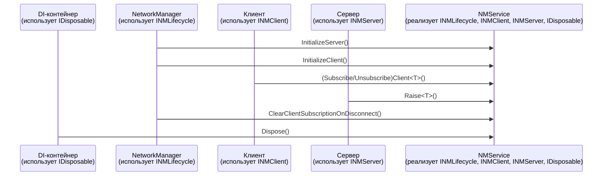

# Результат

<video src="https://github.com/user-attachments/assets/9162210d-d813-421d-a04e-a164b88c55ac" width="100%" controls playsinline></video>

# NMService

Централизованный сервис для управления сетевыми сообщениями, реализующий паттерн "Издатель-Подписчик" с клиент-серверной фильтрацией. Позволяет клиентам подписываться на конкретные типы сообщений, а серверу — отправлять их только заинтересованным клиентам.

## Поток управления

## Интерфейсы

| Интерфейс | Кто использует | Назначение |
|-----------|----------------|------------|
| `INMLifecycle` | NetworkManager | Управление жизненным циклом: инициализация обработчиков и очистка подписок при отключении клиентов |
| `INMServer` | Серверные скрипты | Отправка событий клиентам |
| `INMClient` | Клиентские скрипты | Клиентские подписки на события |
| `IDisposable` | DI-контейнер | Очистка ресурсов |
